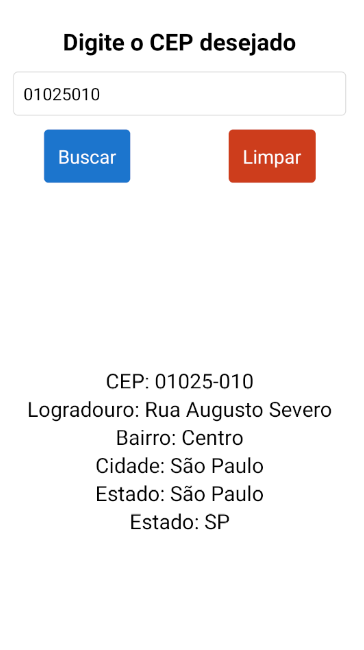

# Buscador de CEP

Este é um aplicativo simples construído em React Native que permite aos usuários buscar informações de endereço a partir de um CEP (Código de Endereçamento Postal) brasileiro.

## Demonstração



## Funcionalidades
O aplicativo possui uma interface intuitiva com as seguintes funcionalidades:

- **Campo de Entrada de CEP:** Um campo de texto para o usuário digitar o CEP que deseja consultar. O teclado é numérico para facilitar a digitação.

- **Botão "Buscar":** Ao ser pressionado, o aplicativo realiza uma consulta à API [ViaCEP](https://viacep.com.br/) para obter os dados do endereço correspondente ao CEP informado.

- **Botão "Limpar":** Limpa o campo de texto do CEP e o foca novamente, permitindo que o usuário realize uma nova busca rapidamente.

- **Exibição de Resultados:** Após uma busca bem-sucedida, as informações do endereço são exibidas na tela, incluindo:
  - CEP
  - Logradouro
  - Bairro
  - Cidade
  - Estado

## Tecnologias Utilizadas

- **React Native:** Framework para desenvolvimento de aplicativos móveis multiplataforma.
- **Axios:** Cliente HTTP para realizar a requisição à API ViaCEP.
- **ViaCEP API:** Serviço web gratuito para consulta de CEPs do Brasil.
- **Expo:** Plataforma e conjunto de ferramentas para construir aplicativos React Native.

## 🚀 Como Executar o Projeto

Siga os passos abaixo para rodar o projeto em seu ambiente de desenvolvimento.

### Pré-requisitos

- [Node.js](https://nodejs.org/en/)
- [Yarn](https://yarnpkg.com/) ou [NPM](https://www.npmjs.com/)
- [Expo CLI](https://docs.expo.dev/get-started/installation/)
- Ambiente de desenvolvimento React Native configurado. Siga o [guia oficial](https://reactnative.dev/docs/environment-setup).

### Instalação

1. **Clone o repositório:**
   ```bash
   git clone https://github.com/liedsonlm7/buscador_cep.git
   cd buscadorCep
   ```

2. **Instale as dependências:**
   ```bash
   npm install
   # ou
   yarn install
   ```

3. **Execute o aplicativo:**
   ```bash
   # Com Expo (recomendado)
   npx expo start

   # Ou com React Native CLI
   # Para Android
   npx react-native run-android

   # Para iOS
   npx react-native run-ios
   ```
